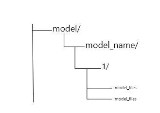

## Testing the inference

### 1. Deploy the model using Tensorflow Serving


* Tensorflow Serving follows directory structure like this to search and host the model.



* Once you followed the above structure, just execute this command to host the model.

```bash 
docker run --rm -d -p 8500:8500 -p 8501:8501 --mount type=bind,source="absolute/path/to/model/directory",target=/models -e MODEL_NAME=model_name -t tensorflow/serving
```

Log's tail of a successful deployment will look like following:
```bash
2022-08-09 07:36:02.901908: I tensorflow_serving/core/loader_harness.cc:87] Successfully loaded servable version {name: text_classifier version: 1}
2022-08-09 07:36:02.905054: I tensorflow_serving/model_servers/server_core.cc:486] Finished adding/updating models
2022-08-09 07:36:02.905101: I tensorflow_serving/model_servers/server.cc:367] Profiler service is enabled
2022-08-09 07:36:02.907687: I tensorflow_serving/model_servers/server.cc:393] Running gRPC ModelServer at 0.0.0.0:8500 .
```

* Now you can you inference.py to send HTTP request to model for inference.